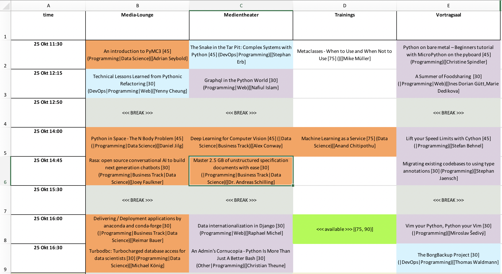

# Conference Scheduler

This is a tool to help scheduling conferences. 
It was used to schedule e.g.  
 * EuroPython 2017
 * PyConDE & PyData Karlsruhe 2107
 * EuroPython 2018 
 * PyConDE & PyData Karlsruhe 2018
 
 The API was inspired by the (PyConUK ConferenceScheduler)[https://github.com/PyconUK/ConferenceScheduler] 👋
 though a diffent path to built the schedule was chosen.

### Main Features:

 * Conference Setup
 * Room Set-Up
 * Dealing with presenters' availibilities
    * Late arrivals / early departure
    * Managing presenters' availibilties
    * Clustering of similar topics
    * Spreading popular talks across the schedule
    * Building tracks fo topics
 * Taking results of a user votion into account
 * Export to Excel or group review.

This scheduler is designed to built schedules.
As of now it does not manage schedule changes.

It will not work out of the box, 
you need to write some adapters for your input data still.

##### Note: work in progress! 
For this release EuroPython specific stuff was removed though there might still be some artefacts.

#### Example  schedule for group review



### Background

Conference scheduling is a hard task, 
there are just too many possibilties.

A good schedule should apart for managing availibilites of resources (persenters, rooms)
also account for like:
 * similar topics should be clustered
 * popularity - room sizes

Also we have to consider:
 * there is not **one** perfect schedule, maybe there is **one** perfect schedkle for one individual.
 * unlikely there is ** one** schedule that will be a perfect solution for a large group of individuals.

also __soft__ parameters that help buliding a good schedule as
 * someone is a good presenter (and should kick of a session block)
 * someone is a funny presenter (and a good operner / closer)
 * the topic is light (and is a good fit for after lunch)

finally we also have to consider:
 * information quality (are user generated tags generalizeable and objective?)


Based on experice this scheduler was designed for a human touch.


### How it Works

This scheduler follows the following simple priciples:
 * random is our friend
 * editorial experice of the program comitee should be utilized
 * create a simple output for group review


## Building a Conference

For each resource type there is a **class**.

The conference has __Speakers__ with availibities.
A __Presentation__ has one or more __Speakers__ and is assigned to a __Session__. 
A __Session__ has n slots that can host __Presentation__s.

All the above is fit into a __Conference__ with __Rooms__ and a time frame.
Each day of the conference has one or multiple __Sessions__.

### 1. Conference Set-Up - Confercence Class
The Confercence class keeps track of:
 * start and end dates and times of the conference
 * sessions to be scheduled
 * sessions scheduled


### 2. Schedule Class
The Schedule class:
 * adds new sessions
 * assigns sessions to slots
 * export session to excel for review
 * export session to json for data exchange

### 3. Room Class
Simple resource class
 * room name
 * room capacity

### 4. Session Class
 * start end end time
 * has slots to host presenations
 * slots may have duration range, e.g. 30-45 minutes for slots before breaks
 * exposes if there a still slot available of if the session is fully booked.

### 5. Presentation Class
 * title of the presenation
 * presenters
 * duration
 * various metadata attributes for e.g. difficulty level or topics

### 5. Speaker Class
The Speaker class keeps track of:
 * name of the presenter
 * manage availitily
 * prevent contraints
 * manage early arrival
 * manage early departure

### Set-Up

```
pip install bla bla requirements and stuff
```

#### Example set up

Creating the confernce.

```
pycon = Conference(
    starts_at=datetime.datetime(2017, 10, 25, 10, 0),
    ends_at=datetime.datetime(2017, 10, 27, 16, 1),
    dbpath=None,  # we will bet out data elsewhere
    conference_key=''  # optional key used in database to indentify conference's submissions
)
```

Adding accepted presenations, presenters adding a full list of presenations to the _myconference_.
Beforehand you will need to write some adapters to get the data in.

```
pycon.get_accepted_presentations()
pycon.create_presenters()
pycon.create_presentationslist()
```

Add room resoucres and add them to _myconference_.

```
# rooms and capacities
# set this for the current conference
rooms = {
    'Medientheater': 280,
    'Vortragsaal': 90,
    'Media-Lounge': 30,
    'Trainings': 30,
}

for r in rooms:
    pycon.rooms.add(
        Room(r, rooms[r])
    )
```

Adding the conference layout.
This amy be some footwork especially if the conference layout is differnt one some days.

The below will create a session:
 * just for the first day
 * start 11:30
 * end 12:35
 * two slots (in ranges)
 * just allowing 45 minutes presentation in the first slot and only 30-45 minutes for the second slot.
 * it will create a ssion in each of the rooms


```
name = "morning"
start = datetime.timedelta(hours=11, minutes=30)
end = datetime.timedelta(hours=12, minutes=35)
ranges = [[(45, 45), (30, 45)]] * 3

for day in pycon.conference_days[:1]:
    _rooms = talk_rooms_list
    random.shuffle(list(_rooms))
    for i, room in enumerate(_rooms):
        create_session(pycon, name, room, day, start, end, ranges[i])
```

Dealing with speacial presenters' availibities, i.e. arrivals and early departures.
(Being busy while presenting at the conference is handled automatically)
```
# Ada Lovelace, Wed,Thu has to leave Friday really early
pycon.set_speaker_departure(speaker_id='ada_001', date_time=datetime.datetime(2017, 10, 27))  # set to Fri 0:00
# Isaac Newton, cannot make it before Friday
pycon.set_speaker_arrival(speaker_id='gravity_101', date_time=datetime.datetime(2017, 10, 27))  # set to Fri 0:00
```

### Scheduling Presentations

optional step: spread most popular talks all over the conference randomly, assign them to the bigger rooms.

```
for talk_id in pycon.get_most_popular(15):
    pycon.assign_presentation_to_session(talk_id,
                                         room_name=['Medientheater'])

```

Adding the remaining talks. 
Note: _get_most_popular()_  always returns all unassigned presenations sorted by populartity.

```
# assign presenations
the_talks = pycon.get_most_popular(len(pycon.presentations_to_schedule))
# random.shuffle(the_talks)  # optional
for talk_id in the_talks:
    pres = pycon.presentations_to_schedule[talk_id]
    for min_similarity_value in range(100, -1, -10):
        print("assigning {}".format(pres))
        assigned = pycon.assign_presentation_to_session(talk_id,
                                                        room_name=talk_room_names(),
                                                        min_similarity_value=min_similarity_value)
    if not assigned:
        print("--> not assigned {}".format(pres))
```

Finally for doublechecking check the final results.
```

print("== UNSCHEDULED ==")
for i, x in enumerate(pycon.presentations_to_schedule.values(), 1):
    print(i, x.title, x.duration, x.session_type)

print("== SESSIONS WITH OPEN SLOTS ==")
for s in pycon.schedule.session_with_slots():
    if s.name == 'BREAK':
        continue
    print(s.minutes_available, s.max_slot_duration_available, s.room.name, s.starts_at)
```

Export the schedule in a excel table for group review.

```
# pass over Speakers for schedule print outs
pycon.schedule.speakers = pycon.conference_speakers

os.makedirs('schedules', exist_ok=True)
pycon.schedule.export_excel()
```

You can adapt the scheduling easyily to your needs / improve the outcome 
by selection some presenation by some attribute (e.g. tagged 'data science' or 'web') first.
Then add the selection to the schedule only within a certain time frame or a set of rooms:

```
assign_presentation_to_session(talk_id,
                               room_name=category.get('room_preference', talk_room_names_list),
                                                       starts_at=category.get('starts_at'),
                                                       ends_at=category.get('ends_at'))
```
There are some more options as similarity hints and mininum similarities required between presenations in a session.


In case something went wront / debugging / soublechecking, save unscheduled
```
# save unscheduled to disk
with open('schedules/V{}_unscheduled.json'.format(datetime.datetime.now().strftime("%Y-%m-%d_%H-%M")), 'w') as f:
    json.dump(list([{
        'id': x.presentation_id,
        'title': x.title,
        'track': list(x.track),
        'tags': list(x.tags), 'category': list(x.category),
        'duration': x.duration,
        'session_type': x.session_type,
        'admin_type': x.admin_type,
    } for x in pycon.presentations_to_schedule.values()]), f)

```


### Ideas for Further Developement

* API improvements for higher abstarction levels
* Standardize inputs for better usabilty
* REST-API for interaction with other 


### Final Advice
Keep it simple, over-optimizing this may not just be a waste of your precious time but it may also lead to bad results.

